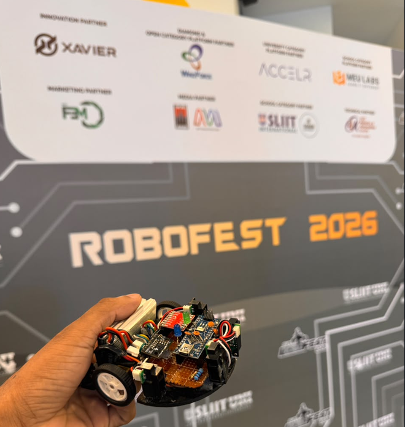
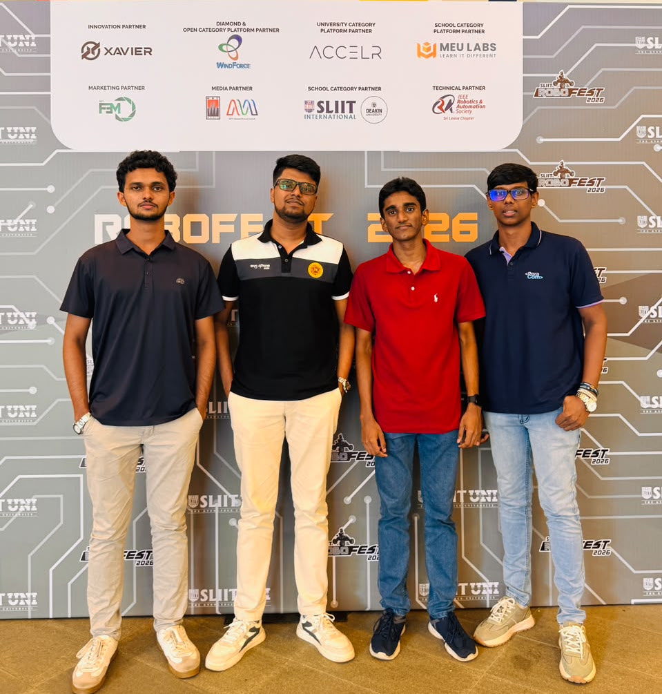
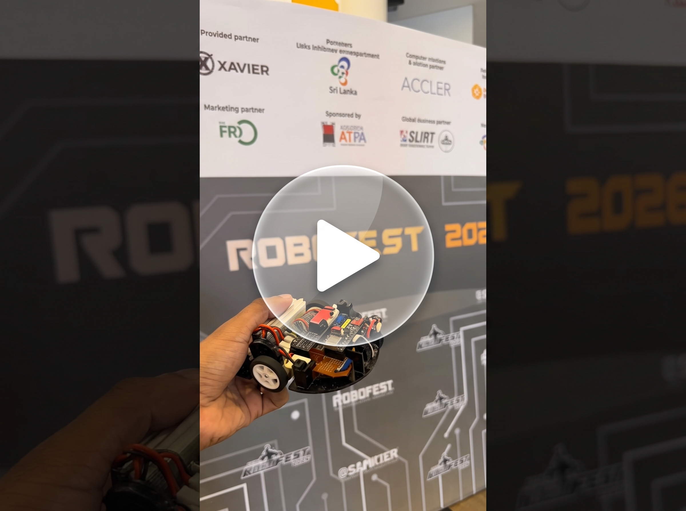
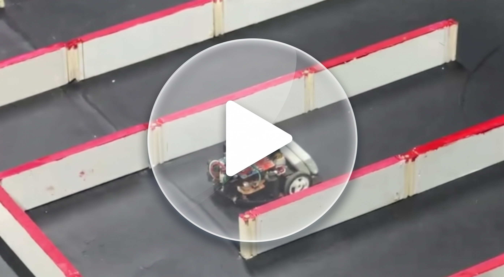
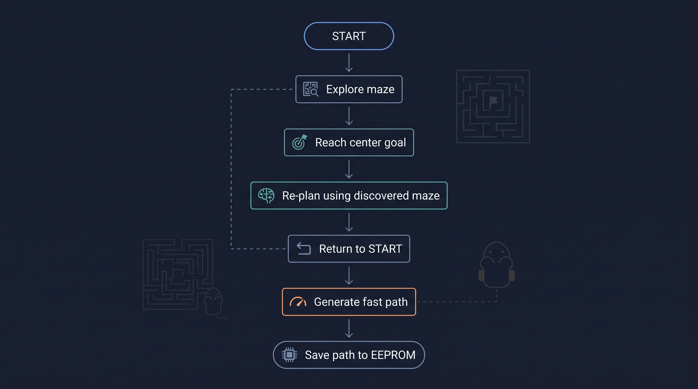
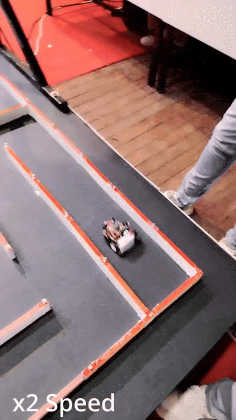
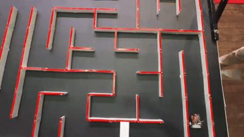
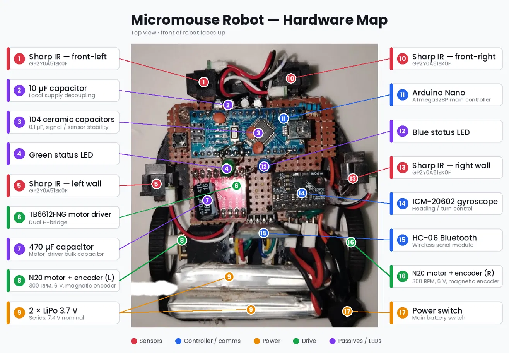

# Robofest2026-MicroMouse-Finalist

# 🤖 Mansoyanno Micromouse

> An autonomous second-generation Micromouse built by Team Mansoyanno for competitive maze solving.

  

**Mansoyanno** is our second-generation Micromouse robot, developed over approximately two months and designed around autonomous maze exploration, flood-fill path planning, sensor-based wall detection, and high-speed path execution.

The robot was developed and tested for competitive Micromouse events, including **Micromouse IIT** and **RoboFest 2026**.

---

## 🏆 RoboFest 2026 — Top 10 in Sri Lanka

Our biggest competition milestone was **RoboFest 2026**, Sri Lanka's premier robotics competition organized by the Faculty of Engineering at SLIIT.

**Team Mansoyanno placed among the Top 10 teams from 130 applicants.**

  

### Team Members

* **Bhanuka**
* **Apurwa**
* **Ryan**
* **Tharusha**

The robot was developed collaboratively, including the mechanical design, electronics, firmware, maze-solving system, testing, and competition preparation.

RoboFest 2026 was held at SLIIT Campus, Malabe, on 27–28 September 2026.

---

## 🎥 Robot in Action

We tested Mansoyanno in three main operating modes:

| Run                  | Purpose                       | Approx. Time |
| -------------------- | ----------------------------- | -----------: |
| 🧭 Flood-Fill Search | Explore and map the maze      |            — |
| ⚡ Pivot Fast Run     | Reliable high-speed execution |        ~40 s |
| 🚀 Arc Fast Run      | Maximum speed                 |        ~20 s |

The arc-based run prioritizes speed by carrying momentum through corners, while the pivot-based run prioritizes repeatability and reliability.
---

## 🏆 RoboFest 2026

RoboFest 2026 became the major competition milestone for Mansoyanno.

The team competed at SLIIT's RoboFest 2026 and finished among the **Top 10 teams from 130 applicants**.

  

---

# 🏁 Competition Journey

## Micromouse IIT

Our first major competition experience with this generation of the project.

  

---

# 🧠 What Makes Mansoyanno Different?

Mansoyanno combines several systems into one autonomous Micromouse platform:

* 🧭 Flood-fill maze solving
* 🧱 Dynamic wall mapping
* 🔄 Round-trip exploration
* 🎯 2×2 center goal detection
* 💾 EEPROM fast-path storage
* ⚡ Pivot-based fast runs
* 🚀 Arc-based fast runs
* 🌀 Gyroscope-assisted heading control
* ⚙️ Magnetic encoder feedback
* 📡 Wireless debugging and tuning through HC-06
* 💡 LED-based robot state indication
* 🛑 Sensor-based collision protection

---

# 🧭 How the Robot Solves the Maze

Mansoyanno uses a **flood-fill algorithm** to determine which neighboring cell is closest to the current target.

The robot does not simply follow a pre-programmed maze route.

Instead, it:

1. Starts at the maze entrance.
2. Reads the surrounding walls using four IR distance sensors.
3. Updates its internal maze representation.
4. Calculates flood-fill distances toward the center.
5. Chooses the best available neighboring cell.
6. Moves one cell at a time.
7. Repeats the process as new walls are discovered.
8. Detects when the center goal is reached.
9. Recalculates the route back to the starting cell.
10. Uses the accumulated maze information to generate a fast path.
11. Saves the resulting path to EEPROM.

This allows the robot to explore the maze while continuously updating its understanding of the environment.

---

# 🔄 Round-Trip Exploration

One of the important features of the search algorithm is that the robot does not simply stop after reaching the center.

After reaching the goal, Mansoyanno switches its flood-fill target back to the starting cell `(0,0)` and navigates back.

This creates a two-phase search:

  

The return journey can therefore use information discovered during the first exploration and may take a different route.

---

# ⚡ Fast Run System

After exploration, the robot generates and stores a fast path through the discovered maze.

Mansoyanno supports two different fast-run strategies.

## Pivot Fast Run

The robot performs conventional 90° pivot turns at corners.

**Priority:** Reliability

Approximate recorded run:

**~40 seconds**

  

---

## Arc Fast Run

Instead of completely stopping and pivoting at every corner, the robot performs faster arc-style cornering.

**Priority:** Speed

Approximate recorded run:

**~20 seconds**

  

The arc run is considerably faster, but requires more precise motion tuning.

---

# 💾 EEPROM Path Storage

Once the search run is complete, the generated fast path is stored in the Arduino Nano's EEPROM.

The robot can therefore retain its discovered path after power is removed.

The LED state indicates whether a saved path is available:

| LED      | Meaning                   |
| -------- | ------------------------- |
| 🟢 Green | No saved path             |
| 🔵 Blue  | Fast path saved and ready |

A saved path allows the robot to start a fast run without having to perform the complete exploration again.

---

# 🎮 User Interface

The robot uses the front and side IR sensors for simple hand-gesture control.

### Search

With no saved path, placing a hand in front of a front sensor starts the search run.

The robot then:

**Searches → reaches center → returns to start → generates path → saves path**

---

### Pivot Fast Run

With a saved path, a gesture in front of the right-side/front sensor selects the pivot fast-run mode.

---

### Arc Fast Run

With a saved path, a gesture on the left-side sensor selects the arc fast-run mode.

---

### Clear Saved Path

Holding hands in front of both front sensors clears the stored path.

The robot performs a small movement to indicate that the memory has been cleared.

---

# 🔧 Hardware

| Component          | Description                         |
| ------------------ | ----------------------------------- |
| Microcontroller    | Arduino Nano                        |
| Motor Driver       | TB6612FNG                           |
| Motors             | N20 300 RPM, 6 V, magnetic encoders |
| Gyroscope          | ICM-20602                           |
| Wall Sensors       | 4 × Sharp GP2Y0A51SK0F              |
| Wireless Interface | HC-06 Bluetooth                     |
| Battery            | 2 × 3.7 V LiPo in series            |
| Chassis            | Custom 3D-printed chassis           |
| Electronics        | Hand-soldered dot board             |
| Status LEDs        | Green + Blue                        |

### Hardware Layout

The four Sharp IR sensors are arranged as:

  

Two sensors face forward for front-wall detection and two sensors face sideways for left/right wall detection.

---

# 🌀 Motion Control

Mansoyanno combines multiple feedback sources for controlled movement.

### Gyroscope

The ICM-20602 provides angular-rate information for heading and turn control.

It is used particularly for controlled 90° and 180° turns.

### Encoders

The magnetic motor encoders provide wheel movement feedback.

Encoder feedback is used during cell movement and motion correction.

### IR Sensors

The IR sensors provide information about nearby maze walls.

The robot uses these measurements both for maze mapping and motion correction.

---

# 📡 Wireless Debugging

An **HC-06 Bluetooth module** is used as a wireless serial interface.

This allows the team to:

* Monitor robot status
* Debug the maze-solving system
* Inspect sensor readings
* Tune motion parameters
* Tune wall thresholds
* Adjust fast-run parameters

This was particularly useful during repeated testing and competition preparation.

---

# 🏗️ Development

Mansoyanno is our **second-generation Micromouse**.

The project evolved from our earlier Micromouse platform:

**V1 → V2**

Our earlier Micromouse project is available here:

[**Maze Titans — V1 GitHub Repository**](https://github.com/RyanJFM/Maze-Titans)

The first-generation platform helped establish our experience with maze robotics and hardware integration.

V2 was developed as a more competition-focused platform with a stronger emphasis on autonomous exploration, feedback-based motion control, persistent fast-path storage, and high-speed execution.

---

# ⭐ Project

**Mansoyanno Micromouse — 2026**

Built, tested, tuned, and competed by **Team Mansoyanno**.
